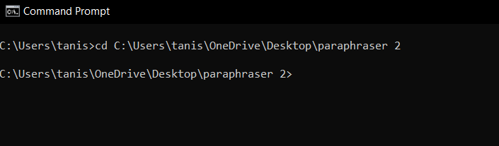
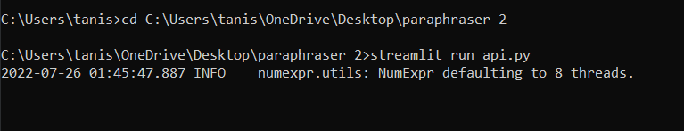
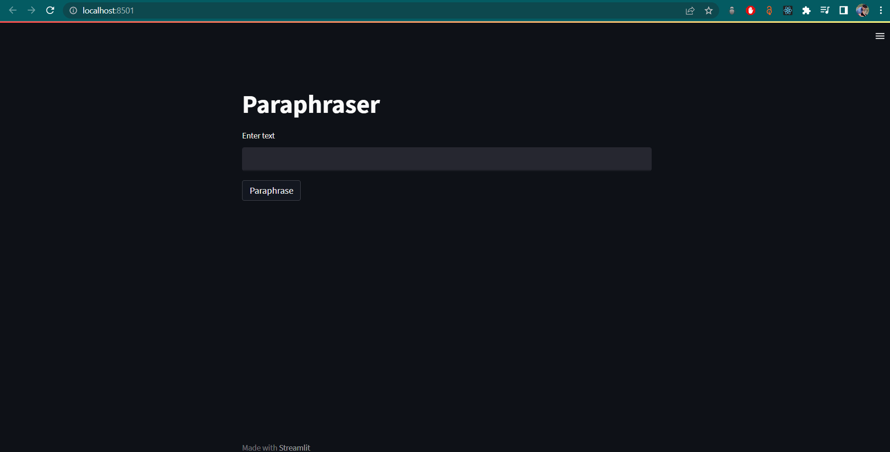

# paraphraser_api


This toolkit is created from scratch using Pegasus Model (PEGASUS: Pre-training with Extracted Gap-sentences for Abstractive Summarization)

### About
It is recommended to run rephraser_source_code.ipynb on local system
rather than Google Colab because the saved model file is more than 2GB in size, and attempting to 
download it crashes the environment. Running it locally will take time but no issues will be there 
during saving the model.


## Deployment

To run this project you can either download the zip file or clone it using git cli.

For cloning using git cli:
```bash
    gh repo clone tanishque02/paraphraser_api
```
### Dependencies
For running the model you'll be needing the following Dependencies
1. transformers

```bash
    pip install transformers
```
2. SentencePiece
```bash
    pip install SentencePiece
```
3. torch
```bash
    pip install torch
```
For the flask API
1. streamlit
```bash
    pip install streamlit
```

## Setting up
### Getting the trained model
1. Run all the cells after installing all the dependencies mentioned above.
2. A "model2.pth" file will be created in the same directory where the program is.


### Starting the API
1. Make sure that the "api.py" is in the same directory with the "model2.pth"
2. Open command prompt and change the working directory to the one which contains both "api.py" and "model2.pth"

3.
```bash
  streamlit run api.py
```


4. The API will run at localhost:8501

